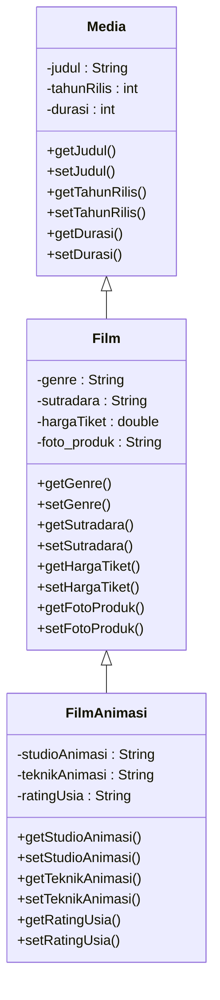
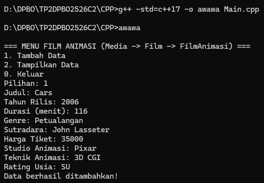
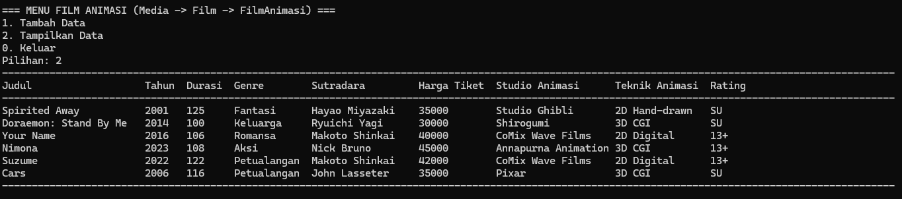
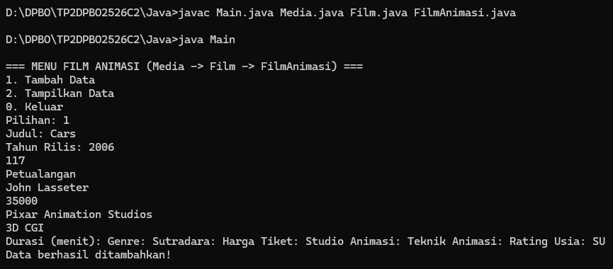
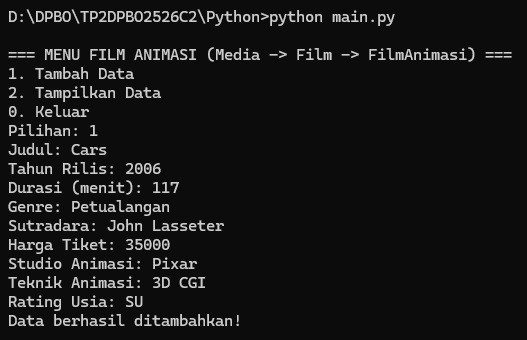
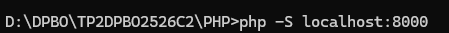
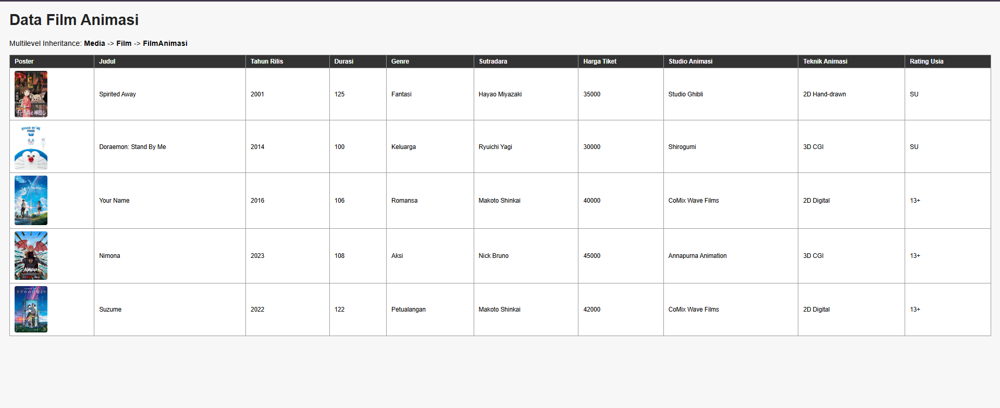

# TP2 DPBO - Manajemen Data Film Animasi (Multilevel Inheritance)

Nama : Ariq Ahmad Fathir
NIM  : 2506752
Kelas : C2

## Janji

Saya Ariq Ahmad Fathir dengan NIM 2506752 mengerjakan TP 2 DPBO 2026 C2 dalam mata kuliah
Desain dan Pemrograman Berorientasi Objek untuk keberkahan-Nya, maka saya tidak melakukan
kecurangan seperti yang telah dispesifikasikan. Aamiin.

## Tentang Programnya

Program ini mengembangkan tema TP1 (manajemen data film bioskop) menjadi kasus
**Multilevel Inheritance** dengan 3 tingkat class:

```
Media -> Film -> FilmAnimasi
```

Konsepnya dibuat make sense dengan dunia nyata: setiap **Film Animasi** pasti sebuah **Film**,
dan setiap **Film** pasti sebuah **Media** (hubungan *is-a*). Semakin ke bawah levelnya, atributnya
semakin spesifik.

Dibuat di 4 bahasa: C++, Java, Python (CLI/menu di terminal), dan PHP (web).

## Penjelasan Atribut dan Method

### Class `Media` (Parent paling atas)
Atribut umum yang dimiliki semua jenis media:
| Atribut | Tipe | Keterangan |
|---|---|---|
| `judul` | String | Judul media |
| `tahunRilis` | int | Tahun media dirilis |
| `durasi` | int | Durasi dalam menit |

Method: `getJudul/setJudul`, `getTahunRilis/setTahunRilis`, `getDurasi/setDurasi`, dan constructor.

### Class `Film` (Child dari `Media`)
Menambahkan atribut yang spesifik untuk film bioskop:
| Atribut | Tipe | Keterangan |
|---|---|---|
| `genre` | String | Genre film |
| `sutradara` | String | Nama sutradara |
| `hargaTiket` | double | Harga tiket bioskop |
| `foto_produk` *(khusus PHP)* | String | Nama file poster film (file gambarnya ada di folder `PHP/posters/`) |

Constructor `Film` memanggil constructor `Media` (`super()` / `parent::__construct()` / `: Media(...)`
tergantung bahasa) untuk mengisi atribut yang diwarisi.

### Class `FilmAnimasi` (Child dari `Film`, cucu dari `Media`)
Menambahkan atribut yang spesifik untuk film animasi:
| Atribut | Tipe | Keterangan |
|---|---|---|
| `studioAnimasi` | String | Studio yang memproduksi animasi |
| `teknikAnimasi` | String | Teknik animasi (2D Hand-drawn / 3D CGI / Stop Motion) |
| `ratingUsia` | String | Rating usia penonton (SU / 13+ / 17+) |

Constructor `FilmAnimasi` memanggil constructor `Film`, yang otomatis juga memanggil constructor
`Media` di dalamnya — inilah yang membuatnya **Multilevel Inheritance**.

Setiap object `FilmAnimasi` otomatis memiliki **seluruh atribut dari ketiga level**
(`Media` + `Film` + `FilmAnimasi`) berkat pewarisan, tanpa perlu menulis ulang atribut
`judul`, `tahunRilis`, `durasi`, `genre`, `sutradara`, dan `hargaTiket`.

## Design Diagram



> Catatan: atribut `foto_produk` pada class `Film` hanya ada di implementasi PHP,
> sesuai requirement TP2 (khusus bahasa PHP).

## Cara Menjalankan / Kompilasi

Perintah kompilasinya sama di semua OS. Yang beda cuma cara **memanggil hasil compile**
(khusus C++) dan nama perintah Python.

### C++

Compile (sama di semua OS):
```
cd CPP
g++ -std=c++17 -o awawa Main.cpp
```

Jalankan:
| OS | Perintah |
|---|---|
| Windows (CMD) | `awawa` atau `awawa.exe` |
| Mac / Linux | `./awawa` |

> Di Windows, `./awawa` **tidak akan jalan** ("is not recognized..."), karena `./` itu sintaks
> Linux/Mac. Cukup ketik `awawa` saja.

### Java

Compile & jalankan (sama persis di semua OS):
```
cd Java
javac Main.java Media.java Film.java FilmAnimasi.java
java Main
```

### Python

Jalankan:
| OS | Perintah |
|---|---|
| Windows | `python main.py` |
| Mac / Linux | `python3 main.py` |

> Di Windows, `python3` sering memicu pesan "Python was not found; run without arguments to
> install from the Microsoft Store..." meskipun Python sudah terinstall. Solusinya:
> 1. Kalau Python memang belum terinstall, download dari https://www.python.org/downloads/
>    (bukan dari Microsoft Store) dan centang **"Add python.exe to PATH"** saat instalasi.
> 2. Kalau sudah terinstall tapi masih muncul pesan itu, matikan alias-nya di
>    **Settings -> Apps -> Advanced app settings -> App execution aliases**, matikan toggle
>    **App Installer python.exe / python3.exe**, lalu buka CMD baru.
>
> Di Mac/Linux biasanya `python` mengarah ke Python 2 (atau tidak ada sama sekali), jadi harus
> pakai `python3`.

### PHP

Harus lewat server, tidak bisa dibuka langsung dari file (perintahnya sama di semua OS,
asal PHP sudah terinstall dan ada di PATH):
```
cd PHP
php -S localhost:8000
```
lalu buka `http://localhost:8000/index.php` di browser.

> Folder `posters/` di dalam folder `PHP` berisi file gambar poster untuk kelima film
> (nama file harus sama persis dengan nilai atribut `foto_produk` masing-masing objek,
> lihat tabel di `index.php`). Ganti isi file-file di folder itu dengan poster asli
> kalau mau (tetap pakai nama file yang sama), atau tambah objek baru + poster baru
> sesuai kebutuhan.

### Menjalankan dengan Testcase

Testcase input otomatis (untuk C++/Java/Python) tersedia di masing-masing folder bahasa
(`testcase_cpp.txt`, `testcase_java.txt`, `testcase_python.txt`) — isinya cuma baris-baris input
mentah (tanpa komentar), urutannya: pilih menu Tambah (1) -> isi 9 field data film animasi baru
-> pilih Tampilkan Data (2) -> Keluar (0).

| Bahasa | Windows | Mac / Linux |
|---|---|---|
| C++ | `awawa < testcase_cpp.txt` | `./awawa < testcase_cpp.txt` |
| Java | `java Main < testcase_java.txt` | `java Main < testcase_java.txt` |
| Python | `python main.py < testcase_python.txt` | `python3 main.py < testcase_python.txt` |

> Testcase ini untuk kebutuhan verifikasi cepat saja. Untuk dokumentasi (screenshot/screenrecord),
> sebaiknya isi datanya manual lewat terminal, bukan pakai redirect file, supaya kelihatan program
> beneran dijalankan interaktif.

## Flow Programnya

Untuk versi CLI (C++/Java/Python), semuanya mirip:

1. Program mulai dengan **5 objek `FilmAnimasi` awal** yang sudah dibuat langsung di `main`
   sebelum ada input apapun dari user, supaya tabel langsung terisi saat program pertama kali jalan.
2. Muncul menu looping terus sampai user pilih Keluar:
   - **1. Tambah Data** -> user input 9 field (judul, tahun rilis, durasi, genre, sutradara,
     harga tiket, studio animasi, teknik animasi, rating usia), lalu dibuatkan object `FilmAnimasi`
     baru lewat constructor-nya (yang otomatis memanggil constructor `Film` dan `Media`), lalu
     dimasukkan ke list/array.
   - **2. Tampilkan Data** -> looping semua isi list, ditampilkan dalam **satu tabel** yang berisi
     gabungan atribut dari ketiga level class (Media + Film + FilmAnimasi) secara lengkap.
   - **0. Keluar** -> program berhenti.

Untuk versi PHP (web):

- `Media.php`, `Film.php`, `FilmAnimasi.php` isi class-nya saja (constructor + getter/setter),
  strukturnya sama persis dengan versi lain (Multilevel Inheritance 3 level).
- `index.php` yang jadi "otaknya": inisialisasi **5 objek awal secara hardcode** (bukan dari
  form/input user), lalu langsung menampilkannya dalam satu tabel — sekaligus nampilin HTML-nya
  di file yang sama.
- Versi PHP ini **tidak punya fitur Tambah Data** (beda dari C++/Java/Python yang wajib bisa
  menerima input user) — sesuai requirement TP2 yang membolehkan PHP hanya hardcode.
- Setiap baris tabel menampilkan poster film (``), diambil dari atribut
  `foto_produk` yang isinya nama file gambar di folder `posters/`.

## Dokumentasi

Taruh file screenshot/screen record di masing-masing folder `Dokumentasi/<Bahasa>/` dengan
nama persis seperti di bawah, supaya link gambarnya otomatis kebaca:

- `run+add.png` -> proses compile/run program lalu input Tambah Data secara manual di terminal
  (dipakai C++, Java, Python)
- `tampil.png` -> hasil tabel setelah pilih menu Tampilkan Data (dipakai C++, Java, Python, dan PHP)
- `run.png` -> khusus PHP, screenshot server PHP jalan / halaman awal di browser (PHP tidak punya
  fitur Tambah Data, jadi tidak ada `run+add.png`, cuma `run.png` + `tampil.png`)

### C++

**run+add**



**tampil**



### Java

**run+add**



**tampil**


### Python

**run+add**



**tampil**


### PHP

**run**



**tampil**


